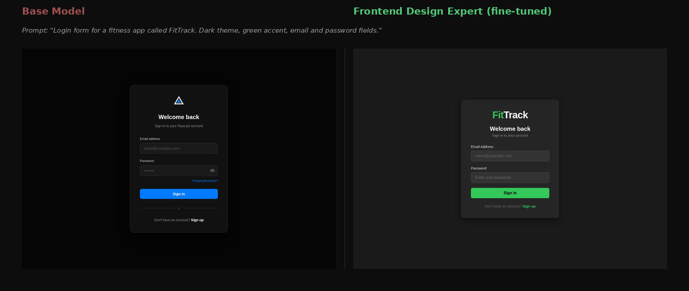

<svg width="800" height="160" xmlns="http://www.w3.org/2000/svg">
  <rect width="800" height="160" fill="#0d0d0d" rx="8"/>
  <text x="400" y="55" font-family="sans-serif" font-size="28" font-weight="bold"
        fill="white" text-anchor="middle">Frontend Design Expert</text>
  <text x="400" y="85" font-family="sans-serif" font-size="14"
        fill="#888" text-anchor="middle">Fine-tuned Qwen3-VL that asks before it builds</text>
  <rect x="95" y="105" width="110" height="26" fill="#1a3a5c" rx="4"/>
  <text x="150" y="123" font-family="sans-serif" font-size="12" fill="#60a5fa" text-anchor="middle">Qwen3-VL-8B</text>
  <rect x="215" y="105" width="110" height="26" fill="#1a3a1a" rx="4"/>
  <text x="270" y="123" font-family="sans-serif" font-size="12" fill="#4ade80" text-anchor="middle">GPT-5.4 trained</text>
  <rect x="335" y="105" width="110" height="26" fill="#2a1a3a" rx="4"/>
  <text x="390" y="123" font-family="sans-serif" font-size="12" fill="#c084fc" text-anchor="middle">3,090 records</text>
  <rect x="455" y="105" width="110" height="26" fill="#3a2a0a" rx="4"/>
  <text x="510" y="123" font-family="sans-serif" font-size="12" fill="#fb923c" text-anchor="middle">98.1% accuracy</text>
  <rect x="575" y="105" width="110" height="26" fill="#1a1a1a" rx="4"/>
  <text x="630" y="123" font-family="sans-serif" font-size="12" fill="#9ca3af" text-anchor="middle">Apache 2.0</text>
</svg>

Base models build immediately — even on vague requests. This model asks first.

<svg width="800" height="220" xmlns="http://www.w3.org/2000/svg">
  <!-- Left panel - Base Model -->
  <rect x="10" y="10" width="375" height="200" fill="#111" rx="6" stroke="#ef4444" stroke-width="1.5"/>
  <rect x="10" y="10" width="375" height="32" fill="#1a1a1a" rx="6"/>
  <rect x="10" y="32" width="375" height="10" fill="#1a1a1a"/>
  <text x="197" y="31" font-family="sans-serif" font-size="11" fill="#ef4444" text-anchor="middle">Base Model</text>
  <text x="25" y="65" font-family="monospace" font-size="11" fill="#4ade80">&gt; build me a website for my dog daycare</text>
  <text x="25" y="85" font-family="monospace" font-size="10" fill="#6b7280">[immediately generates 400 lines of HTML]</text>
  <text x="25" y="105" font-family="monospace" font-size="10" fill="#374151">&lt;!DOCTYPE html&gt;</text>
  <text x="25" y="120" font-family="monospace" font-size="10" fill="#374151">&lt;html&gt;&lt;head&gt;...</text>
  <text x="25" y="135" font-family="monospace" font-size="10" fill="#374151">&lt;title&gt;Dog Care Services&lt;/title&gt;</text>
  <text x="25" y="155" font-family="monospace" font-size="10" fill="#4b5563">// Generic. Wrong brand name.</text>
  <text x="25" y="175" font-family="monospace" font-size="10" fill="#4b5563">// Blue buttons (you asked for nothing).</text>
  <text x="25" y="195" font-family="monospace" font-size="10" fill="#4b5563">// No contact form. No booking.</text>
  <!-- Right panel - Fine-tuned -->
  <rect x="415" y="10" width="375" height="200" fill="#111" rx="6" stroke="#4ade80" stroke-width="1.5"/>
  <rect x="415" y="10" width="375" height="32" fill="#1a1a1a" rx="6"/>
  <rect x="415" y="32" width="375" height="10" fill="#1a1a1a"/>
  <text x="602" y="31" font-family="sans-serif" font-size="11" fill="#4ade80" text-anchor="middle">Frontend Design Expert</text>
  <text x="430" y="65" font-family="monospace" font-size="11" fill="#4ade80">&gt; build me a website for my dog daycare</text>
  <text x="430" y="85" font-family="monospace" font-size="11" fill="#e5e7eb">Three quick questions:</text>
  <text x="430" y="105" font-family="monospace" font-size="11" fill="#d1d5db">1. Contact info or online booking?</text>
  <text x="430" y="125" font-family="monospace" font-size="11" fill="#d1d5db">2. One page or multiple pages?</text>
  <text x="430" y="145" font-family="monospace" font-size="11" fill="#d1d5db">3. Fun/playful or clean/professional?</text>
  <text x="430" y="175" font-family="monospace" font-size="10" fill="#4b5563">// Then builds exactly what you need.</text>
  <text x="430" y="195" font-family="monospace" font-size="10" fill="#4b5563">// Right brand. Right colors. Right layout.</text>
</svg>

## Before / After



*Left: base Qwen3-VL-8B ignores the brand name and uses blue. Right: fine-tuned model applies FitTrack branding and green accent throughout.*

## Training Pipeline

<svg width="800" height="80" xmlns="http://www.w3.org/2000/svg">
  <rect width="800" height="80" fill="#0d0d0d" rx="6"/>
  <!-- Boxes -->
  <rect x="10" y="20" width="100" height="36" fill="#1a1a2e" rx="4" stroke="#3b82f6" stroke-width="1"/>
  <text x="60" y="42" font-family="sans-serif" font-size="10" fill="#93c5fd" text-anchor="middle">Natural Prompt</text>
  <rect x="130" y="20" width="100" height="36" fill="#1a1a2e" rx="4" stroke="#3b82f6" stroke-width="1"/>
  <text x="180" y="36" font-family="sans-serif" font-size="10" fill="#93c5fd" text-anchor="middle">Qwen3.6-27B</text>
  <text x="180" y="50" font-family="sans-serif" font-size="9" fill="#6b7280" text-anchor="middle">generates HTML</text>
  <rect x="250" y="20" width="100" height="36" fill="#1a1a2e" rx="4" stroke="#3b82f6" stroke-width="1"/>
  <text x="300" y="36" font-family="sans-serif" font-size="10" fill="#93c5fd" text-anchor="middle">Playwright</text>
  <text x="300" y="50" font-family="sans-serif" font-size="9" fill="#6b7280" text-anchor="middle">renders PNG</text>
  <rect x="370" y="20" width="100" height="36" fill="#1a1a2e" rx="4" stroke="#8b5cf6" stroke-width="1"/>
  <text x="420" y="36" font-family="sans-serif" font-size="10" fill="#c4b5fd" text-anchor="middle">GPT-5.4</text>
  <text x="420" y="50" font-family="sans-serif" font-size="9" fill="#6b7280" text-anchor="middle">critiques + improves</text>
  <rect x="490" y="20" width="100" height="36" fill="#1a1a2e" rx="4" stroke="#8b5cf6" stroke-width="1"/>
  <text x="540" y="36" font-family="sans-serif" font-size="10" fill="#c4b5fd" text-anchor="middle">3,090 Records</text>
  <text x="540" y="50" font-family="sans-serif" font-size="9" fill="#6b7280" text-anchor="middle">JSONL dataset</text>
  <rect x="610" y="20" width="120" height="36" fill="#0d2d0d" rx="4" stroke="#4ade80" stroke-width="1.5"/>
  <text x="670" y="36" font-family="sans-serif" font-size="10" fill="#4ade80" text-anchor="middle">Fine-tuned 8B</text>
  <text x="670" y="50" font-family="sans-serif" font-size="9" fill="#6b7280" text-anchor="middle">Frontend Expert</text>
  <!-- Arrows -->
  <line x1="110" y1="38" x2="128" y2="38" stroke="#4ade80" stroke-width="1.5" marker-end="url(#arr)"/>
  <line x1="230" y1="38" x2="248" y2="38" stroke="#4ade80" stroke-width="1.5" marker-end="url(#arr)"/>
  <line x1="350" y1="38" x2="368" y2="38" stroke="#4ade80" stroke-width="1.5" marker-end="url(#arr)"/>
  <line x1="470" y1="38" x2="488" y2="38" stroke="#4ade80" stroke-width="1.5" marker-end="url(#arr)"/>
  <line x1="590" y1="38" x2="608" y2="38" stroke="#4ade80" stroke-width="1.5" marker-end="url(#arr)"/>
  <defs>
    <marker id="arr" markerWidth="6" markerHeight="6" refX="3" refY="3" orient="auto">
      <path d="M0,0 L0,6 L6,3 z" fill="#4ade80"/>
    </marker>
  </defs>
</svg>

Teacher-student distillation: Qwen3.6-27B generates HTML components from natural language prompts → Playwright renders each to desktop and mobile screenshots → GPT-5.4 critiques the design and rewrites with expert improvements → training pairs capture the gap between a competent model and an expert.

3,090 training records across 8 types: `prompt_to_html`, `screenshot_to_critique`, `screenshot_to_code`, `mobile_to_code`, `screenshot_html_to_critique`, `screenshot_code_critique_to_improved`, `qualifying_conversation`, `immediate_conversation`.

## Validation Results

| Test | Base Qwen3-VL-8B | Fine-tuned 8B | Fine-tuned 4B |
|---|---|---|---|
| Qualifying questions (10 vague prompts) | 1/10 | **10/10** | **8/10** |
| Vision critique quality | Vague, no measurements | px + hex + WCAG AA | px + hex + WCAG AA |
| Token accuracy | — | **98.1%** | **92.5%** |
| Clean HTML output | Verbose + markdown | Zero wrapper text | ~36 wrapper chars |
| Brand name fidelity | Uses own brand names | Follows prompt | Follows prompt |
| Accent color fidelity | Defaults to blue | Applies correctly | Applies correctly |

The qualifying question result (1/10 → 10/10) is the headline. Base models are RLHF-tuned to be immediately helpful — they build regardless of how vague the request is. This behavior cannot be fixed with a system prompt; it has to be trained into the weights.

## Quick Start

### Download

```bash
# 8B Expert — 12GB GPU (RTX 3060, RTX 4070, M2/M3 Mac 16GB)
ollama pull stefans71/frontend-design-expert-8b

# 4B Lite — 8GB GPU
ollama pull stefans71/frontend-design-lite-4b
```

### Use

```bash
# Component generation
ollama run stefans71/frontend-design-expert-8b \
  "make me a pricing card for my SaaS called TaskFlow, dark theme, purple accent"

# Vision critique (requires llama-server + mmproj)
llama-server \
  -m frontend-design-expert-Q4_K_M.gguf \
  --mmproj mmproj-F16.gguf \
  -c 8192 --port 8080
# Then: "Critique this UI design." [attach screenshot]
```

> **Vision critique trigger:** Use exactly `"Critique this UI design."` — the model learned this phrase during training.

## Models

| Model | Size | GPU | HuggingFace |
|---|---|---|---|
| Frontend Design Expert 8B | Q4: 4.7GB | 12GB | [stefans71/frontend-design-expert-8b](https://huggingface.co/stefans71/frontend-design-expert-8b) |
| Frontend Design Lite 4B | Q4: 2.4GB | 8GB | [stefans71/frontend-design-lite-4b](https://huggingface.co/stefans71/frontend-design-lite-4b) |

## Training Pipeline

This repo contains the full dataset generation pipeline — Bun + TypeScript + Playwright + Codex CLI.
See [PLAN.md](PLAN.md) for the complete implementation and [FRONTEND-DESIGN-MODEL-CARD.md](FRONTEND-DESIGN-MODEL-CARD.md) for architecture details.
