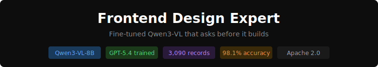
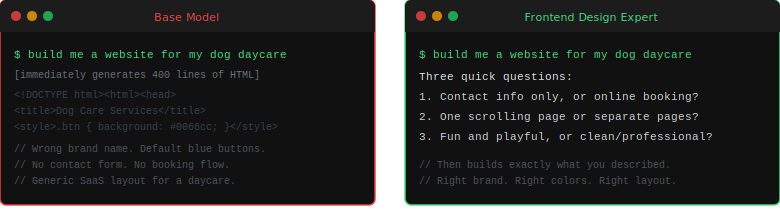
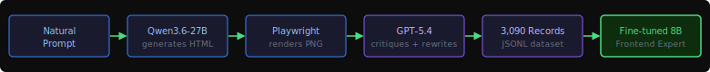

# Frontend Design Expert

<div align="center">



<br>

[](https://huggingface.co/stefans71/frontend-design-expert-8b)
[](https://huggingface.co/stefans71/frontend-design-lite-4b)
[](https://huggingface.co/Qwen/Qwen3-VL-8B-Instruct)
[](LICENSE)

<br>

[The Problem](#the-problem) · [Before / After](#before--after) · [Pipeline](#training-pipeline) · [Results](#validation-results) · [Quick Start](#quick-start) · [Models](#models)

</div>

<br>

## 

Base models are RLHF-tuned to be immediately helpful — they build immediately regardless of how vague the request is. You can't fix this with a system prompt. It has to be trained into the weights.

<br>

<div align="center">

</div>

<br>

The qualifying question result: **1/10 → 10/10** on vague prompts. All 10 tested vague requests triggered clarifying questions from the fine-tuned model; only 1/10 triggered questions from the base model.

<br>

---

<br>

## 

Fine-tuned vs. base Qwen3-VL-8B on the same prompts:

| Prompt | Base Model | Fine-tuned |
|---|---|---|
| Pricing card — dark, purple, 3 tiers | Renders one Pro card | All 3 tiers with "Most Popular" badge |
| Navbar — dog daycare, warm colors | Generic SaaS links, rendering artifacts | Domain-appropriate labels ("Book a Spot") |
| Login form — fitness app, green accent | Blue buttons regardless | Green applied consistently |
| Stats dashboard — revenue + users + churn | One standalone chart | Two linked KPI cards with sparkline |
| Mobile bottom nav — 5 tabs, orange active | Generates a social feed | All 5 labeled tabs, correct active state |
| Testimonial card — minimal, photo + stars | Adds unrequested carousel | Focused single card |

<br>

<div align="center">


</div>

*Left: base Qwen3-VL-8B defaults to blue regardless of prompt. Right: fine-tuned model applies FitTrack branding and green accent throughout every interactive element.*

<br>

---

<br>

## 

<br>

<div align="center">

</div>

<br>

Teacher-student distillation in four stages:

1. **Qwen3.6-27B** generates HTML components from 100 natural language prompts at 5 temperature settings
2. **Playwright** renders each component to desktop (1280×900) and mobile (390×844) screenshots
3. **GPT-5.4** critiques each screenshot and rewrites the HTML with expert design improvements — hover states, WCAG contrast ratios, color consistency, layout hierarchy
4. Training pairs: `[screenshot + original HTML + critique] → [expert improved HTML]`

The gap between Qwen's output and GPT-5.4's improvement is the training signal. 3,090 records across 8 types:

| Record type | Description |
|---|---|
| `screenshot_code_critique_to_improved` | PNG + HTML + critique → expert improved HTML — most valuable |
| `screenshot_to_critique` | Desktop screenshot → design critique with measurements |
| `screenshot_to_code` | Desktop screenshot → HTML reconstruction |
| `mobile_to_code` | Mobile screenshot → HTML |
| `screenshot_html_to_critique` | Screenshot + HTML → detailed critique |
| `prompt_to_html` | Natural language prompt → HTML component |
| `qualifying_conversation` | Vague request → questions → answers → build (150 records) |
| `immediate_conversation` | Clear request → direct build (104 records) |

<br>

---

<br>

## 

Tested against base Qwen3-VL-8B-Instruct on 4 protocols after fine-tuning:

| Test | Base Qwen3-VL-8B | Fine-tuned 8B | Fine-tuned 4B |
|---|---|---|---|
| Qualifying questions (10 vague prompts) | 1/10 | **10/10** | **8/10** |
| Vision critique quality | Vague, no measurements | px + hex + WCAG AA | px + hex + WCAG AA |
| Token accuracy | — | **98.1%** | **92.5%** |
| Clean HTML output | Verbose markdown | Zero wrapper text | ~36 wrapper chars |
| Brand name fidelity | Uses its own names | Follows prompt | Follows prompt |
| Accent color fidelity | Defaults to blue | Applied correctly | Applied correctly |

**Training details:**

| | 8B Expert | 4B Lite |
|---|---|---|
| Base model | Qwen3-VL-8B-Instruct | Qwen3-VL-4B-Instruct |
| Method | QLoRA NF4 4-bit + BF16 LoRA | BF16 LoRA (rank 32) |
| Hardware | RTX 5090 32GB | RTX 5090 32GB |
| Training time | 2h 39m | 53m |
| Final loss | 0.246 | 0.325 |

<br>

---

<br>

## 

### Download

```bash
# 8B Expert — 12GB GPU (RTX 3060, RTX 4070, M2/M3 Mac 16GB)
ollama pull stefans71/frontend-design-expert-8b

# 4B Lite — 8GB GPU
ollama pull stefans71/frontend-design-lite-4b
```

### Generate components

```bash
ollama run stefans71/frontend-design-expert-8b \
  "make me a pricing card for my SaaS called TaskFlow, dark theme, purple accent"
```

### Vision critique (requires llama-server + mmproj)

```bash
llama-server \
  -m frontend-design-expert-Q4_K_M.gguf \
  --mmproj mmproj-F16.gguf \
  -c 8192 --port 8080
```

Then send `"Critique this UI design."` with a screenshot attached.

> **Vision critique trigger:** Use exactly `"Critique this UI design."` — the model learned this phrase during training. Other phrasings may not activate the critique behavior.

<br>

---

<br>

## 

| Model | Q4 size | GPU | HuggingFace |
|---|---|---|---|
| Frontend Design Expert 8B | 4.7 GB | 12 GB | [stefans71/frontend-design-expert-8b](https://huggingface.co/stefans71/frontend-design-expert-8b) |
| Frontend Design Lite 4B | 2.4 GB | 8 GB | [stefans71/frontend-design-lite-4b](https://huggingface.co/stefans71/frontend-design-lite-4b) |

Each model ships with a Q4_K_M GGUF, a Q3_K_M GGUF, and an mmproj file for vision tasks. Ollama handles text-only inference; use llama-server with `--mmproj` for screenshot critique.

**This repo** contains the full dataset generation pipeline — Bun + TypeScript + Playwright + Codex CLI. See [PLAN.md](PLAN.md) for the implementation and [FRONTEND-DESIGN-MODEL-CARD.md](FRONTEND-DESIGN-MODEL-CARD.md) for architecture details.

<br>

---

<p align="center">
  <sub>Fine-tuned on synthetic teacher-student data generated via GPT-5.4 critique of Qwen3.6-27B output · Apache 2.0</sub>
</p>
